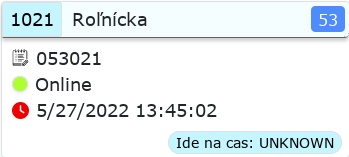

# Dizajn webstránky  

Prvý design s ktorým som uspokojený.

## Časti webovej stránky

### Hlavička stránky

Hlavička webstránky obsahuje **Hľadanie**. Nemá teraz žiadnu funkcialitu, ale mal by existuvať pre nájdenie toho  

### Items

#### Hlavicka items

V hlavicke je vidiet cislo vozidla s pozadim, ktore povie aj v akom stave je vozidla (ci meska, nadbieha alebo ci ide na cas). Farba pozadia pre cislo vozidla je **taka ista** ako farba pozadia v pravo dole, ako pri vypise stavu vozidla (ci meska, nadbieha alebo ide na cas).

Farba pozadia strednej casti hlavicky je tak isto podla stavu vozidla (ci meska, nadbieha alebo ide na cas).

V pravom rohu je cislo linky. Pozadie predstavuje typ vozidla (modre - autobus, atd).

#### Informacie o vozidle

V časti itemu kde sa udáva informácia o vozidle, prvý text hovorí o službu akú má vodič vozidla. Je to označené ikonkou poznámkového zošita s ceruzkou.  

Druhý riadok zodpovedá stavu vozidla (online, offline). Ak je vozidlo je 'Online' krúžok je vyplnená zelenou farbou, ak je 'Offline' krúžok pred textom je vyplnená šedou farbou.

Posledný riadok zodopedá času kedy bola správa odoslaná z vozidla (**state_dtime**).  

Mal by to byť implementované tak, že:

- ak správa bola odoslaná z vozidla ten istý deň, tak vypíše len hodiny, minúty a sekundy
- ak správa bola odoslaná z vozidla *iný deň* - napríklad o deň na to - tak vypíše sa celý dátum vo formáte: dd/MM/YYYY HH:mm:ss.

Existujú 3 ikonky pre túto časť správy a každý má iný význam:

- Správa bola odoslaná pred 1-2 minútami

- Správa bola odoslaná pred viac ako 2 minút, ale menej ako 5 minút

- Správa bola odoslaná pred viac ako 5 minútami

